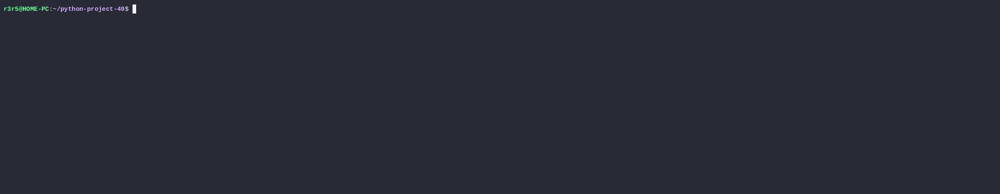
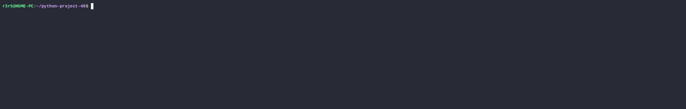

### Description
A collection of 5 different logic games
### Project status
[](https://sonarcloud.io/summary/new_code?id=Den-R3R5_python-project-49)
[](https://sonarcloud.io/summary/new_code?id=Den-R3R5_python-project-49)
[](https://sonarcloud.io/summary/new_code?id=Den-R3R5_python-project-49)
[](https://sonarcloud.io/summary/new_code?id=Den-R3R5_python-project-49)
[](https://sonarcloud.io/summary/new_code?id=Den-R3R5_python-project-49)
[](https://sonarcloud.io/summary/new_code?id=Den-R3R5_python-project-49)
[](https://sonarcloud.io/summary/new_code?id=Den-R3R5_python-project-49)
[](https://sonarcloud.io/summary/new_code?id=Den-R3R5_python-project-49)
[](https://sonarcloud.io/summary/new_code?id=Den-R3R5_python-project-49)
### Hexlet tests and linter status:
[](https://github.com/Den-R3R5/python-project-49/actions)
# Preview
### Even game

### Calc game

### Gcd game

### Progression game

### Prime game

### Tools
| Tool                                                                   | Description                                             |
|------------------------------------------------------------------------|---------------------------------------------------------|
| [uv](https://docs.astral.sh/uv/)                                       | "An extremely fast Python package and project manager, written in Rust" |
| [Prompt](https://github.com/prompt-toolkit/python-prompt-toolkit)                                           | "Library for building powerful interactive command line applications in Python"            |
| [ruff](https://docs.astral.sh/ruff/)                                   | "An extremely fast Python linter and code formatter, written in Rust" |
### Setup 
```bash
make install
```
### Run
```bash
uv run brain-even
```